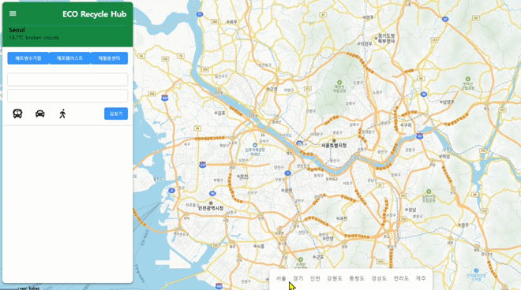
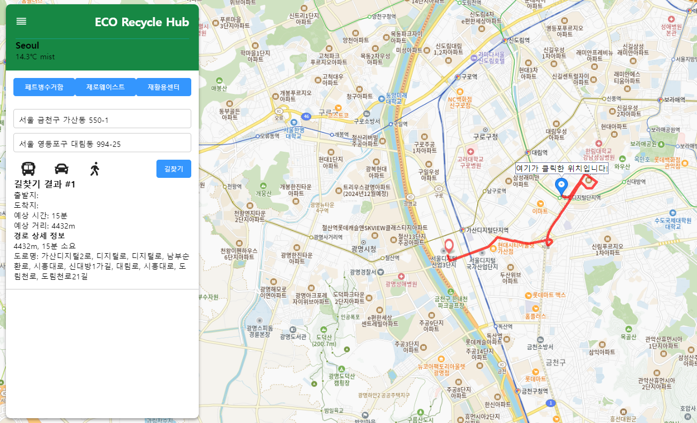
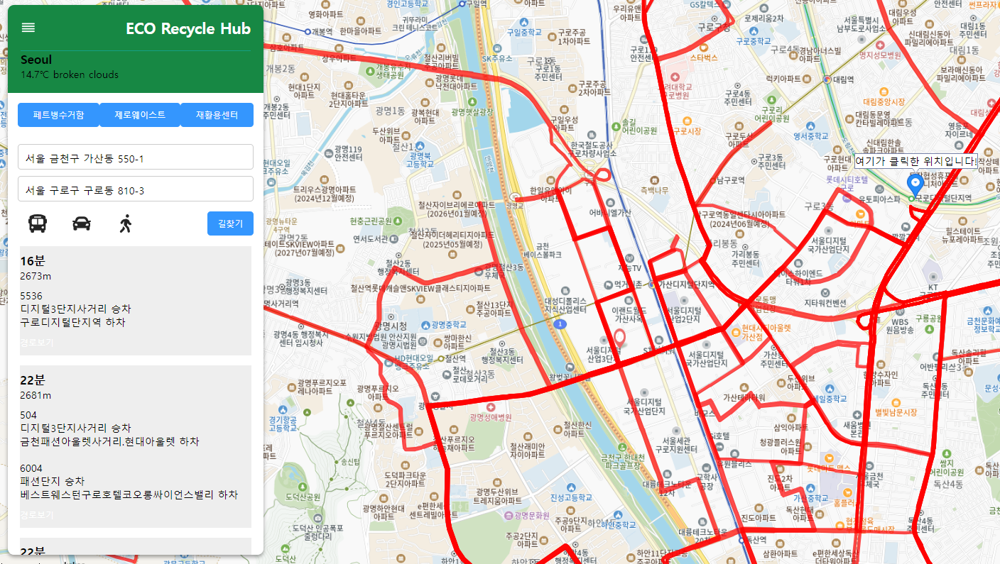
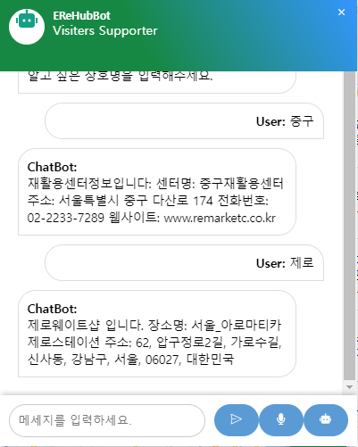
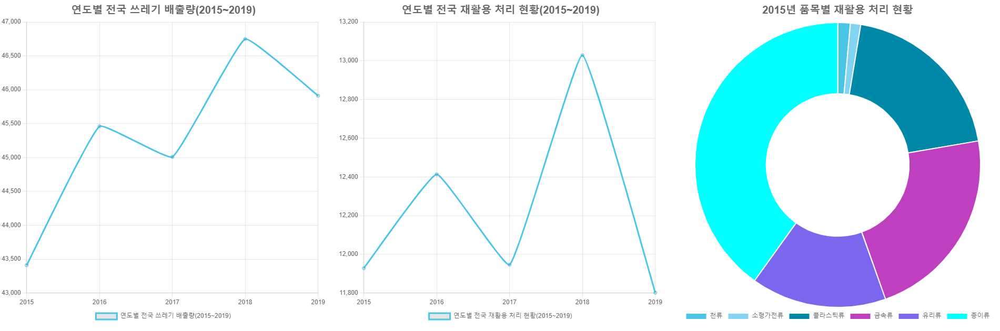
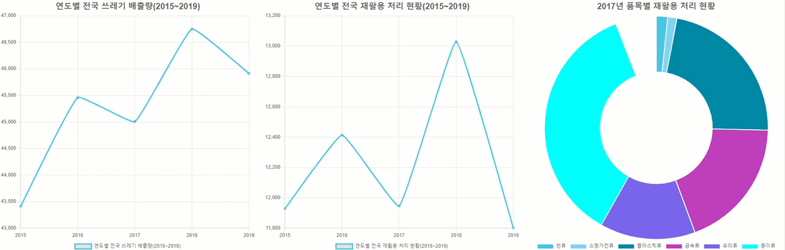
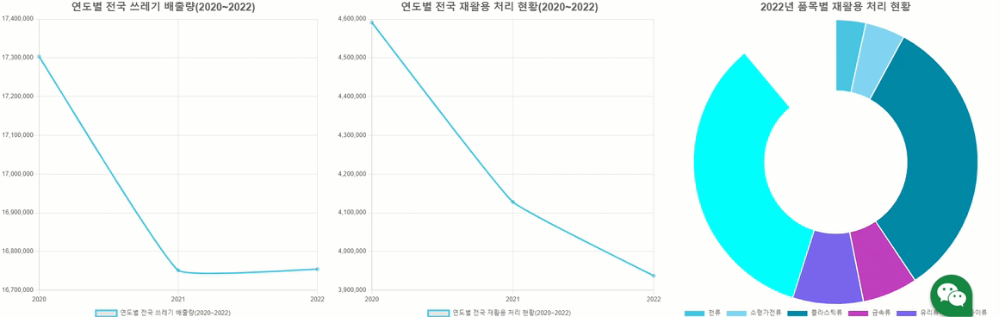
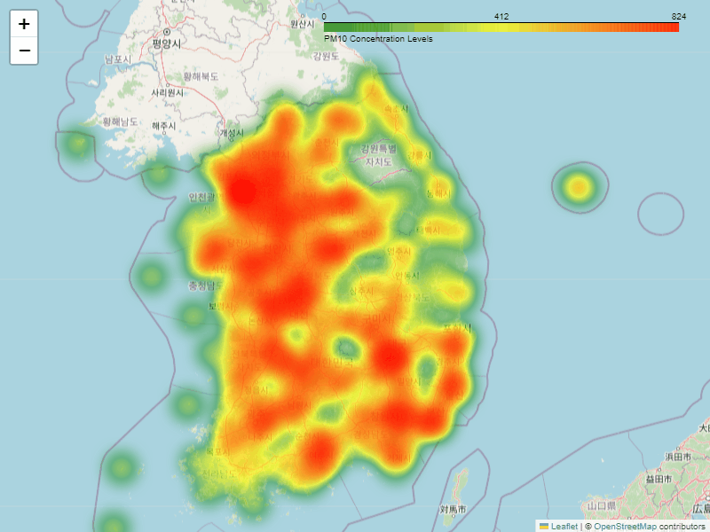

프로젝트 팀장 링크 (https://github.com/KangYeonbae/Project1_3)

# Eco Recyle Hub(에코 리사이클 허브)

바로가기
http://54.82.4.76:3000/

 ## 프로젝트 소개

>이 프로젝트는 이용자, 더 나아가 우리 모두에게 재활용 생활화를 독려하며 유용한 정보와 서비스 제공을 목표로 합니다.
>
>사용자에게 지도 기능을 중점으로 재활용 센터, 페트병 수거 자판기, 제로 웨이스트 샵과 같은 재활용 관련 시설의 정보를 제공하며, 폐기물 배출량과 미세먼지 농도와 같은 환경 지표를 시각적으로 제공하여 사용자들이 지역의 환경 상태를 쉽게 파악할 수 있도록 돕습니다. 또한, 사용자의 위치를 기준으로 가장 가까운 제로 웨이스트 샵까지의 길찾기 기능을 개발하여 좀 더 간편한 서비스를 제공합니다.
>
>이를 통해 우리는 각자의 일상 속에서 환경을 생각하고 실천을 독려하고자 합니다.

## 팀원 소개
코드랩 아카데미 AI 인공지능컨택센터(AICC) 웹서비스개발 1차(23/12/21 ~ 24/06/26)  
강연배, 김인수, 이지우, 김은지

## 기술스택

## 개발 기간
###  3차 프로젝트 : 2024.04.05(금) ~ 2024.05.03(금)
###  4차 프로젝트 : 2024.05.31(금) ~ 2024.06.28(금)
  + 04/05 ~ 04/12
    + 기술 스택 회의
    + 자료 수집과 선정
    + 역할 배분
        + 강연배 - 맵페이지와 챗봇
        + 이은지 - 전반적인 UI/UX 길찾기
        + 이지우 - 게시판,마이페이지,마일리지,미세먼지 예측 그래프
        + 김인수 - 차트페이지

  + 04/15 ~ 04/19
    + 데이터 수집
    + 수집자료 정제 작업
    + 전반적인 Web 디자인
    + 맵 관련 기능 구현
    + 차트 구현
    + 미세먼지 현황 구현

  + 04/22 ~ 04/27
    + 맵 관련 기능 구현
    + UI/UX 디자인
    + 차트 구현
    + 미세먼지 현황 구현
    + 서버 구현

  + 04/29 ~ 05/03
    + 서버 구현
    + UI/UX 디자인
    + 기타 부가 기능 구현
    + 실시간차트 추가구현

  + 05/29 ~  06/26
    + 미세먼지 예측 알고리즘 구현
    + UI/UX 디자인
    + 게시판 마이페이지 구현
    + 재활용품 이미지로 종류 분별 기능 구현 (예로 플라스틱 이미지면 플라스틱 ,캔이면 캔 , 고철이면 고철로)
## 개발환경
- IDE: IntelliJ, Pycham
- Server: NodeJS
- Design: Figma

## 기획안
- 주제선정:"지속 가능한 재활용 시스템이 구축되면 전국 폐기물 발생량이 감소할 것이다"라는 가설을 가지고 사용자들의 재활용 생활화를 독려하며 유용한 정보와 서비스를 제공하는 것을 목표로 하고 있습니다. 

## 프로젝트 아키텍쳐

## 기능 리뷰
### 주요 기능
+ 지도
   + 페트병수거함, 제로웨이스트, 재활용센터의 위치를 파이썬에서 처리하여 리액트로 송출
   + shp파일(지리적파일)을 가져와 파이썬에서 서버로 송출하여 리액트로 2번 정제 후 지도에 표시
   + 모든 위치 자료는 파이썬을 화영하여 SQL에 저장.
     + 재활용센터: 전국재활용센터표준데이터(https://www.data.go.kr/data/15021108/standard.do)
     + 페트병수거함: 해당 사이트에서 웹 스크랩핑 후 csv 파일로 변환하여 파이썬으로 정제
     + 제로웨이스트샵: 사용자가 제작한 구글맵 kml 파일을 가져와 SQL 적재
    
 
    
 + 길찾기
   + 사용자위치 기반
     + Geolocation 기능을 사용해 사용자에게 위치서비스를 요청, 승인한다면 현재 위치를 반환한다.
     + 카카오맵 API를 활용하여 맵의 클릭좌표를 받아온다.
     + 출발 위치부터 도착 위치까지 최단거리를 Polyline으로 표현한다.
   + 자동차 길찾기
     + 걸리는 시간과 경유하는 도로, 거리를 계산한다.
     + 자동표시: 카카오API 활용
   + 대중교통 길찾기
     + 대중교통 API 로 사용자 위치~클릭한 위치까지의 버스.지하철노선을 텍스트타입으로 보여준다. 
     + 대중교통API 에서나온 버스와 지하철 ID 값을 버스.지하철 노선 API에 보내어 노선별 정류소의 위경도값을 지도상에 나타낸다.

 
 

- - -
+ 챗봇 소개
  + 서버로 보내놓은 모든 데이터를 챗봇에서 대답할 수 있도록 한다.
  + 텍스트와 음성 모두 가능하고, 음성말할경우 띄어말하기와 상관없이 서버에서 오는값들중 사용자가 말하거나 입력한 값이 있으면 답변이 가능하도록 구현하였다.
 
 
  
- - -
+ 차트
  + Charths를 이용해 자원순환실천플랫폼에서 제공하는 전국폐기물 발생 및 처리현황 자료를 데이터분석하여 대한민국의 과거 분리배출 결과를 시작적으로 제공한다.
  + 파이차트는 계속하여 움직인다.
    
 

 

 

 # 데이터 조사 과정

### 자원순환마루 사이트
https://www.recycling-info.or.kr/rrs/stat/envStatList.do?menuNo=M13020205

#### 조사과정
1. 폐기물 통계 정보 서비스 사용 신청
2. 전국 폐기물 처리 현황 조사
3. 전국 폐기물 발생 현황 조사
4. 전국 쓰레기 재활용 비율 조사

#### 자료수집
1. OPEN API자료 수집
2. 데이터 기반으로 가정생활쓰레기, 건설폐기물, 사업장쓰레기 별로 나누려고 했으나 최종 결과물를 생각해 통합하여 연도별 전국 쓰레기로 통일
3. 연도는 2015년부터 2022년까지 조사
4. 2020년부터 양식이 바뀌였고 데이터의 폭 차이가 커 (2015년 ~ 2019년), (2020년 ~ 2022년)으로 2개의 DB로 나눔

#### 문제발생  
OPEN API를 이용하여 데이터를 수집하려 하였으나 전국 재활용 비율 조사과정에서 데이터 누락 문제 발생!

### KOSIS국가통계포털
https://kosis.kr/search/search.do?query=%ED%8F%90%EA%B8%B0%EB%AC%BC%C2%A0%EB%B0%9C%EC%83%9D%EB%9F%89

#### 조사과정
1. 전국 쓰레기 발생량
2. 전국 재활용 종류별 처리 현황
3. 2015년 ~ 2022년 데이터

#### 자료수집
1. CSV파일 자료 수집
2. 연도별 전국 종합 통계자료를 csv파일로 받음
3. 자원순환마루 OPEN API 자료와 동일하게 2020년부터 양식이 바뀌기 때문에 자료를 2개로 나눔

#### 문제없으므로 채택결정!

# 그래프 생성 과정

### 연도별 전국 쓰레기 배출량(2015~2019) 그래프 만들기

#### 초기 데이터 전처리
1. '2015~2019년 전국 통계'자료를 사용
2. '2015~2019년 전국 통계'자료에서 필터링이 용이하게 카테고리를 새로 추가

#### Oracle
1. 데이터를 불러오기 위해 데이터임포트, 'YEAR2015'테이블 생성

#### node
1. 오라클에서 데이터 호출
2. 서버구동

#### IntelliJ
1. 노드서버에서 서버데이터 호출
2. 'category2'에서 '총계'를 포함한 데이터 필터링 생성
3. 차트를 생성하고 차트 타입은 'Line'으로 지정
4. map함수를 이용해 연도별, 배출량 데이터 그래프 구현
5. 디자인 및 애니메이션 지정
6. 연도별 전국 쓰레기 배출량(2015~2019) 라인그래프 완성!

### 연도별 전국 재활용 처리 현황(2015~2019) 그래프 만들기

#### 초기 데이터 전처리
1. 2015~2019년 전국 통계자료를 사용
2. 2015~2019년 전국 통계자료에서 필터링이 용이하게 카테고리를 새로 추가

#### Oracle
1. 미리 생성된 'YEAR2015'테이블 사용

#### node
1. 오라클에서 데이터 호출
2. 서버구동

#### IntelliJ
1. 노드서버에서 서버데이터 호출
2. 'category2'에서 '재활용'을 포함하고 'category3'에서 '소계'포함한 데이터 필터링 생성
3. 차트를 생성하고 차트 타입은 'Line'으로 지정
4. map함수를 이용해 연도별, 처리량 데이터 그래프 구현
5. 디자인 및 애니메이션 지정
6. 연도별 전국 재활용 처리 현황(2015~2019) 라인그래프 완성!

### 연도별 전국 쓰레기 배출량(2020~2022) 그래프 만들기

#### 초기 데이터 전처리
1. '2020~2022년 전국 통계'자료를 사용
2. '2020~2022년 전국 통계'자료에서 필터링이 용이하게 카테고리를 새로 추가

#### Oracle
1. 데이터를 불러오기 위해 데이터임포트, 'YEAR2020'테이블 생성

#### node
1. 오라클에서 데이터 호출
2. 서버구동

#### IntelliJ
1. 노드서버에서 서버데이터 호출
2. 'category2'에서 '합계'를 포함한 데이터 필터링 생성
3. 차트를 생성하고 차트 타입은 'Line'으로 지정
4. map함수를 이용해 연도별, 배출량 데이터 그래프 구현
5. 디자인 및 애니메이션 지정
6. 연도별 전국 쓰레기 배출량`(2020~2022) 라인그래프 완성!

### 연도별 전국 재활용 처리 현황(2020~2022) 그래프 만들기

#### 초기 데이터 전처리
1. 2020~2022년 전국 통계자료를 사용
2. 2020~2022년 전국 통계자료에서 필터링이 용이하게 카테고리를 새로 추가

#### Oracle
1. 미리 생성된 'YEAR2020'테이블 사용

#### node
1. 오라클에서 데이터 호출
2. 서버구동

#### IntelliJ
1. 노드서버에서 서버데이터 호출
2. 'category2'에서 '재활용'을 포함하고 'category3'에서 '소계'포함한 데이터 필터링 생성
3. 차트를 생성하고 차트 타입은 'Line'으로 지정
4. map함수를 이용해 연도별, 처리량 데이터 그래프 구현
5. 디자인 및 애니메이션 지정
6. 연도별 전국 재활용 처리 현황(2020~2022) 라인그래프 완성!

### 2015~2019년 상세재활용쓰레기 도넛차트

#### 초기 데이터 전처리
1. 2015~2019년 전국 통계자료를 사용
2. 2015~2019년 전국 통계자료에서 필터링이 용이하게 카테고리를 새로 추가

#### Oracle
1. 미리 생성된 'YEAR2015'테이블 사용

#### node
1. 오라클에서 데이터 호출
2. 서버구동

#### IntelliJ
1. 노드서버에서 서버데이터 호출
2. 현재 연도에 해당하는 데이터 필터링 생성
3. 라벨에 각 종류별 중복값을 그룹하여 '천류', '소형가전류', '플라스틱류', '금속류', '유리류', '종이류'에 합산
4. 그룹한 품목들의 필터링 생성
5. forEach를 사용하여 'filteredData'배열의 각 항목을 반복
6. 차트를 생성하고 차트 타입은 'Line'으로 지정
5. 디자인 및 애니메이션 지정
6. 2015~2019년 상세재활용쓰레기 도넛차트 완성!

### 2020~2022년 상세재활용쓰레기 도넛차트

#### 초기 데이터 전처리
1. 2020~2022년 전국 통계자료를 사용
2. 2020~2022년 전국 통계자료에서 필터링이 용이하게 카테고리를 새로 추가

#### Oracle
1. 미리 생성된 'YEAR2020'테이블 사용

#### node
1. 오라클에서 데이터 호출
2. 서버구동

#### IntelliJ
1. 노드서버에서 서버데이터 호출
2. 현재 연도에 해당하는 데이터 필터링 생성
3. 라벨에 각 종류별 중복값을 그룹하여 '천류', '소형가전류', '플라스틱류', '금속류', '유리류', '종이류'에 합산
4. 그룹한 품목들의 필터링 생성
5. forEach를 사용하여 'filteredData'배열의 각 항목을 반복
6. 차트를 생성하고 차트 타입은 'Line'으로 지정
5. 디자인 및 애니메이션 지정
6. 2020~2022년 상세재활용쓰레기 도넛차트 완성!

# 분석

#### 가설:  
지속 가능한 재활용 시스템이 구축되면 전국 폐기물 발생량이 감소할 것이다.

#### 가설확인:  
1. 쓰레기 배출량과 재활용 처리량 비교
2. 대표적인 재활용품목들의 재활용 처리 현황 확인

#### 해석:  
배출량과 처리량의 그래프를 비교해보면 대체적으로 비슷한 양상을 보이는데 더 자세히 보게 되면 배출량 대비 처리량이 4배 가까이 저조한 차이가 나는 걸 볼 수 있고
재활용품목들에 대해서는 일반사람들이 생각할 수 있는 종이, 플라스틱, 유리, 금속등이 주를 이루고 역시 종이류가 가장 많이 재활용 처리가 되고 있다는걸 알수있다.

#### 결론:  
지금도 재활용가능한 자원을 재활용하려는 노력이 있다는걸 볼수있지만 좀더 확실한 재활용 시스템이 생기면 재활용되지 못하는 폐기물들이 줄어들고
또 소각,매립등 환경오염에 영향이 있는 처리 방식보다 지속 가능한 재활용 시스템이 구축될거라고 기대합니다.

또한 재활용가능한 품목들이나 방식들이 더 생기고 나아진다면 폐기물 발생량을 줄일 수도 있겠지만
재활용량이 배출량을 따라가지 못하는 만큼 근본적 해결방법은 덜 버리고 덜 쓰는게 맞다는 생각이 듭니다.

- - -
+ 미세먼지 농도
  + 공공데이터포털 한국환경공단_에어코리아_대기오염정보(https://www.data.go.kr/iim/api/selectAPIAcountView.do) api 호출
  + 측정소 위 경도 좌표 와 stationName 통합해서 station_info.csv 파일로 병합(지도 위에 데이터를 뿌리기 위함)
  + 과거데이터 3Month(최대)를 모델에 학습시켜 검색일 기준 향후 일주일 미세먼지(pm10value) 농도 예측
  + 
    

- - -
+ 로그인,마이페이지 구현
  + oracle SQL 과 연결하여, 리액트로 로그인,마이페이지 구현.
     
     
    
  + 마일리지 구현
     
     

+ 게시판 기능 구현
   + 글 수정과 삭제는 본인만 가능 (버튼숨김)
      - 본인일때
      - 본인 아닐때

## 차후 개선 포인트
+ 전반적인 UI 리뉴얼
+ 회원가입 추가예정
+ 버스길찾기에서 현위치~클릭위치까지의 버스노선만 나오게 수정예정

- - -
## API
Open Weather(https://openweathermap.org/)  
리액트 카카오맵(https://react-kakao-maps-sdk.jaeseokim.dev/)  
서울특별시_대중교통환승경로 조회 서비스(https://www.data.go.kr/iim/api/selectAPIAcountView.do)

## 라이브러리
react-icons  
react-bootstrap  

## 자료제공
자원순환마루(https://www.recycling-info.or.kr/rrs/main.do)  
공공데이터포털_전국재활용센터표준데이터(https://www.data.go.kr/data/15021108/standard.do)  
공공데이터포털-서울특별시_노선정보조회서비스(https://www.data.go.kr/tcs/dss/selectApiDataDetailView.do?publicDataPk=15000193)
공공데이터포털-서울특별시_대중교통환승경로 조회 서비스(https://www.data.go.kr/tcs/dss/selectApiDataDetailView.do?publicDataPk=15000414)
공공데이터포털 한국환경공단_에어코리아_대기오염정보(https://www.data.go.kr/iim/api/selectAPIAcountView.do)
